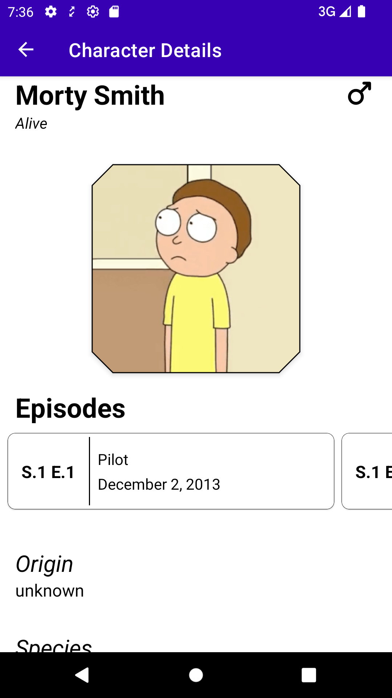
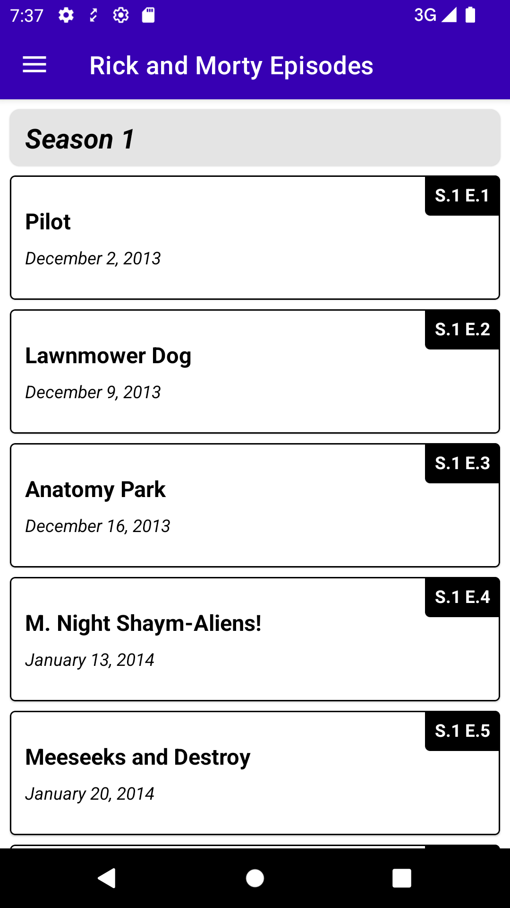
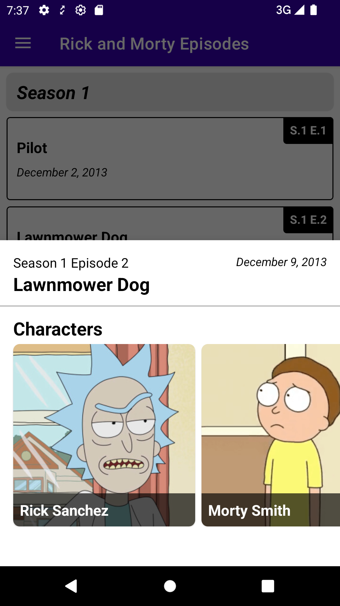
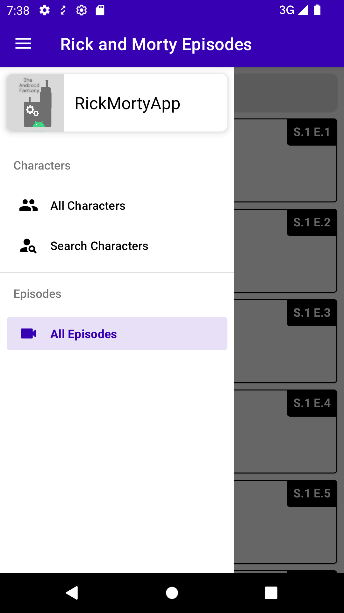
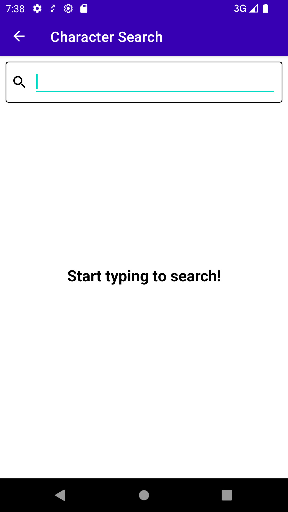
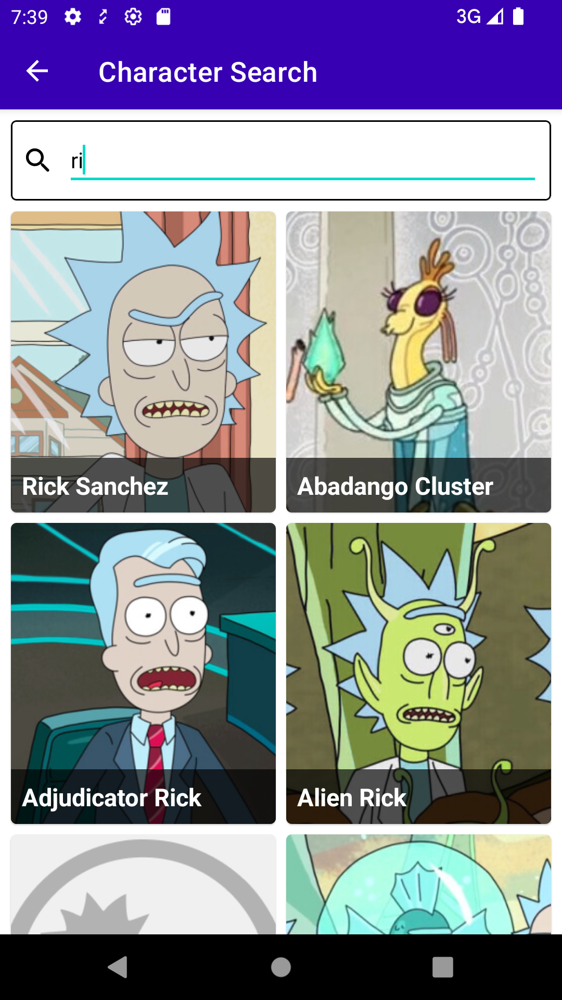
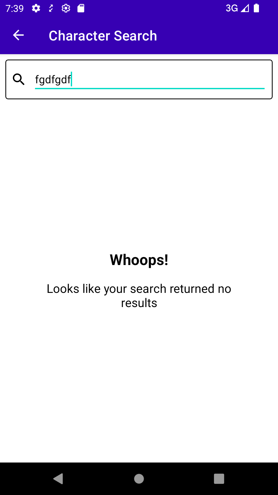

<h1 align="center">RickMorty App</h1>

<p align="center">
  <a href="https://opensource.org/licenses/Apache-2.0"></a>
  <a href="https://android-arsenal.com/api?level=24"></a>
  <br>
  <a href="https://wa.me/+5531989337562"></a>
  <a href="https://www.linkedin.com/in/lucas-emboava-88a04667/"></a>
  <a href="mailto:emboavalucas@gmail.com"></a>
</p>

<p align="center">  

⭐ Esse é um projeto para demonstrar meu conhecimento técnico no desenvolvimento Android nativo com Kotlin estudando através do [The Android Factory](https://www.youtube.com/@TheAndroidFactory). Mais informações técnicas abaixo.

🎥 O app exibe uma lista com os personagens, tela de detalhe, lista de episodios, tela de busca usando a [API Rick and Morty](https://rickandmortyapi.com/) com retrofit, moshi, coroutines, paging 2 e 3,
bottomsheet, navigation drawer, navigation component, caching local, epoxy e arquitetura MVVM.

</p>

</br>

<p float="left" align="center">
  
  
  
  
  
  
  
  
</p>

## Tecnologias usadas e bibliotecas de código aberto

- Minimum SDK level: 24
- [Linguagem Kotlin](https://kotlinlang.org/)

- Jetpack
  - Lifecycle: Observe os ciclos de vida do Android e manipule os estados da interface do usuário após as alterações do ciclo de vida.
  - ViewModel: Gerencia o detentor de dados relacionados à interface do usuário e o ciclo de vida. Permite que os dados sobrevivam a alterações de configuração, como rotações de tela.
  - ViewBinding: Liga os componentes do XML no Kotlin através de uma classe que garante segurança de tipo e outras vantagens.
  - Navigation Component: facilita a navegação entre diferentes telas do seu aplicativo. Ele fornece uma maneira padronizada de gerenciar o fluxo de navegação, o que torna seu código mais fácil de entender e manter.
  - Bottomsheet: Elemento de interface do usuário que desliza para cima da parte inferior da tela, geralmente contendo informações adicionais ou opções para o usuário.
  - Navigation Drawer: Painel deslizante que oferece as opções de navegação principais entre as seções de um app.
  - Paging 2 e 3: Facilita o carregamento e a exibição de grandes conjuntos de dados.

- Arquitetura
  - MVVM (View - ViewModel - Model)
  - Comunicação da ViewModel com a View através de LiveData
  - Comunicação da ViewModel com a Model através de Kotlin Coroutines
  - Repositories para abstração da comunidação com a camada de dados.
  
- Bibliotecas
  - [Retrofit2 & OkHttp3](https://github.com/square/retrofit): Para realizar requisições seguindo o padrão HTTP.
  - [Picasso](https://github.com/bumptech/glide): Facilita o carregamento e a exibição de imagens.
  - [Epoxy](https://github.com/airbnb/epoxy): Facilita a criação de telas complexas em um RecyclerView.
  - [Chunker](https://github.com/ChuckerTeam/chucker): Intercepta todas as requisições e respostas HTTP que passam pelo OkHttp.
  - [Firebase Crashlytics](https://firebase.google.com/): Relatórios de falhas em tempo real que ajuda você a identificar e corrigir problemas em seus aplicativos. 


## Arquitetura
APRESENTE A ARQUITETURA UTILIZADA NO PROJETO
**RickMorty App** utiliza a arquitetura MVVM e o padrão de Repositories, que segue as [recomendações oficiais do Google](https://developer.android.com/topic/architecture).
</br></br>

<br>

## API de terceiros

A [API Rick and Morty](https://rickandmortyapi.com/) fornece acesso a um banco de dados completo com informações sobre a série de televisão Rick and Morty.

## Features

### Feature 1


- Home exibindo listagem de dados da api com imagem nome e cabeçalho por ordem alfabética e com scroll infinito.

### Feature 2


- Tela de detalhe do personagem exibindo suas informações junto com a lista horizontal de episodios que ele aparece que ao ser clicadada exibe um bottomsheet com os personagem do episódio.
- Sistema de cache local onde após pegar os dados pela primeira vez fica guardado ao acessar o mesmo personagem enquanto o app estiver vivo.

### Feature 3


- Navigation Drawer com opções para navegar para outras telas do app.
- Tela de busca que filtra os personagens baseado na busca e exibe um state quando não encontrado.

### Feature 4


- Tela de listagem dos episódios que ao serem clicados exibem um bottomsheet com os personagens presents naquele episódio.

# Licença
```xml
   Copyright [2024] [Lucas Emboava]

   Licensed under the Apache License, Version 2.0 (the "License");
   you may not use this file except in compliance with the License.
   You may obtain a copy of the License at

     http://www.apache.org/licenses/LICENSE-2.0

   Unless required by applicable law or agreed to in writing, software
   distributed under the License is distributed on an "AS IS" BASIS,
   WITHOUT WARRANTIES OR CONDITIONS OF ANY KIND, either express or implied.
   See the License for the specific language governing permissions and
   limitations under the License.
```
